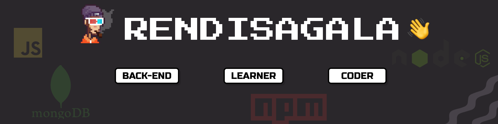

<h1 align="center">!Hola </h1>
<h3 align="center">About Me :</h3>  
 

📚 Accounting Student.
 💡  JavaScript Enthusiast.
 ⭐ Coding
 🖥️ Learning New Things Especially in Tech.
 

  
<h3 align="center">Active On :</h3>  

  
  
  

  
<h3 align="Center">Languages and Tools:</h3>  

 

 

<h3 align="center">Contribution:</h3>

### Keen To Interact with Me?  

If you are interested to discuss any further, I'm always open for a conversation!!✔  

▶️ Shoot me an email at rendisagala19@gmail.com for official discussions or Find me on [LinkedIn](https://www.linkedin.com/in/rendi-anjuma-sagala-a3b2421b6/)  
